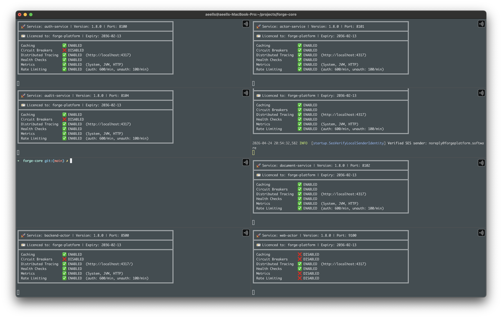
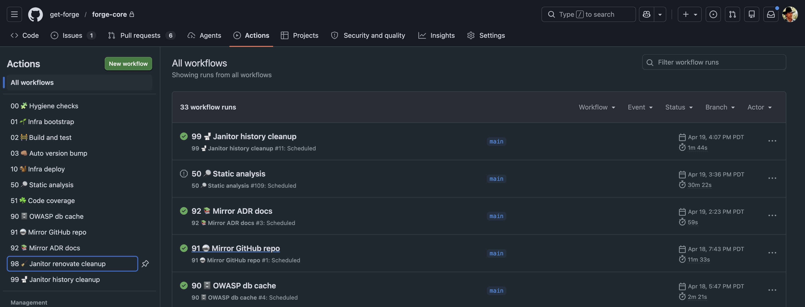
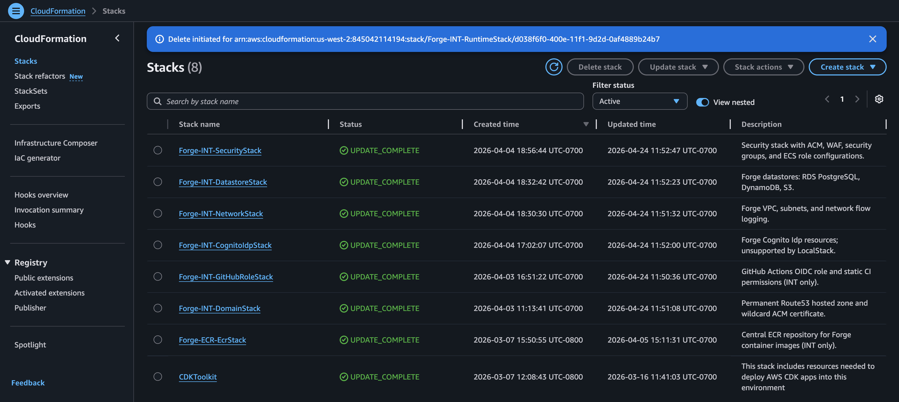
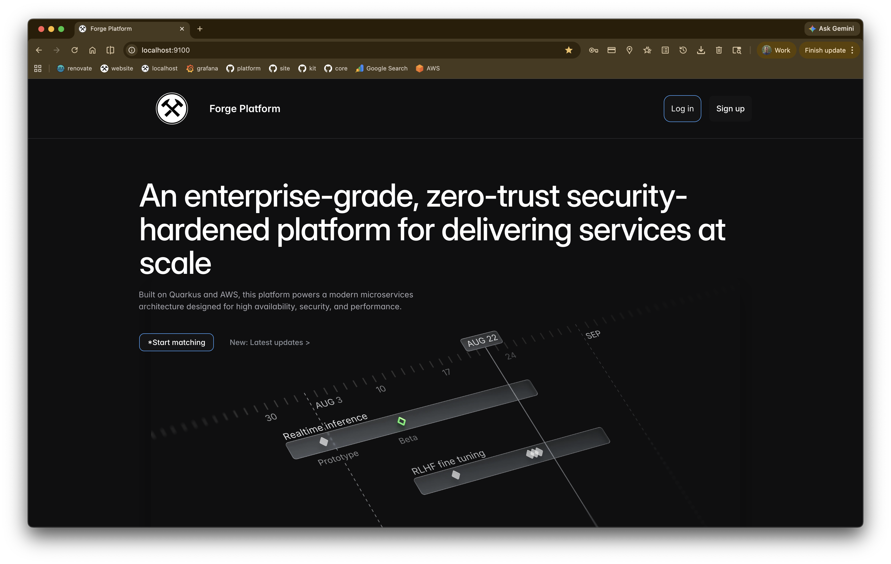
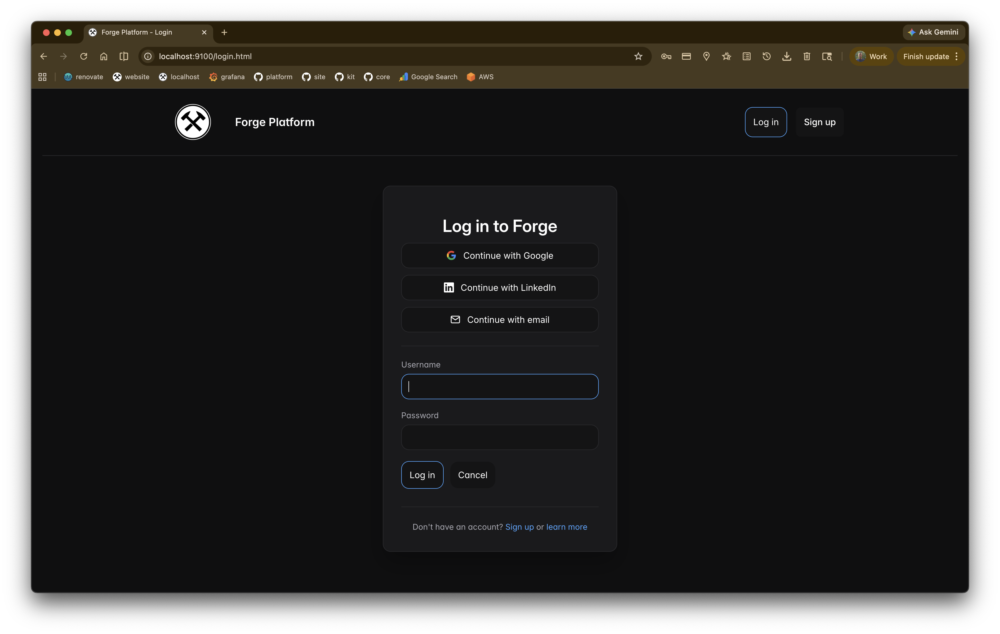
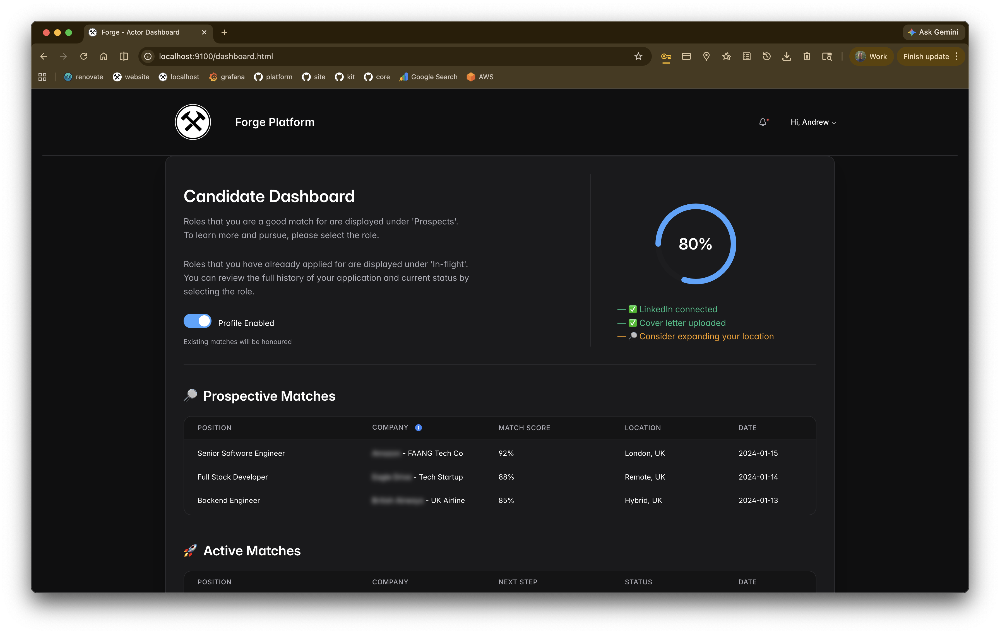
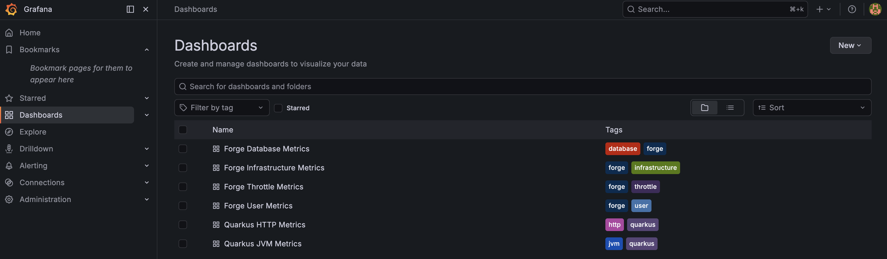
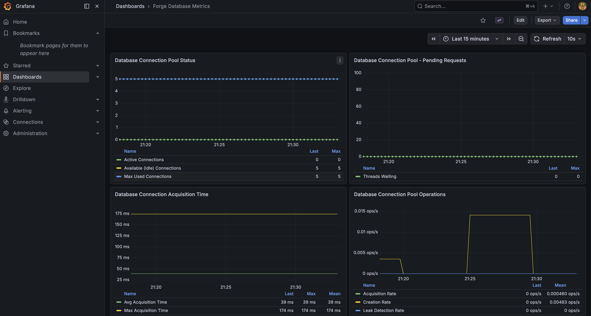
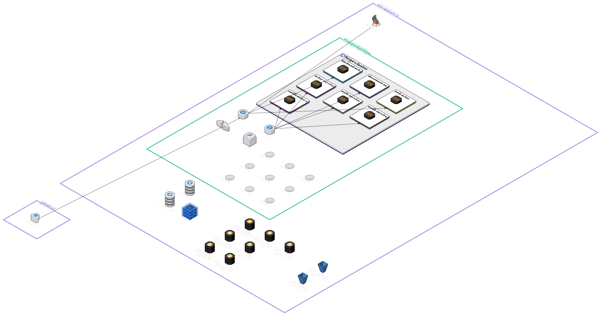
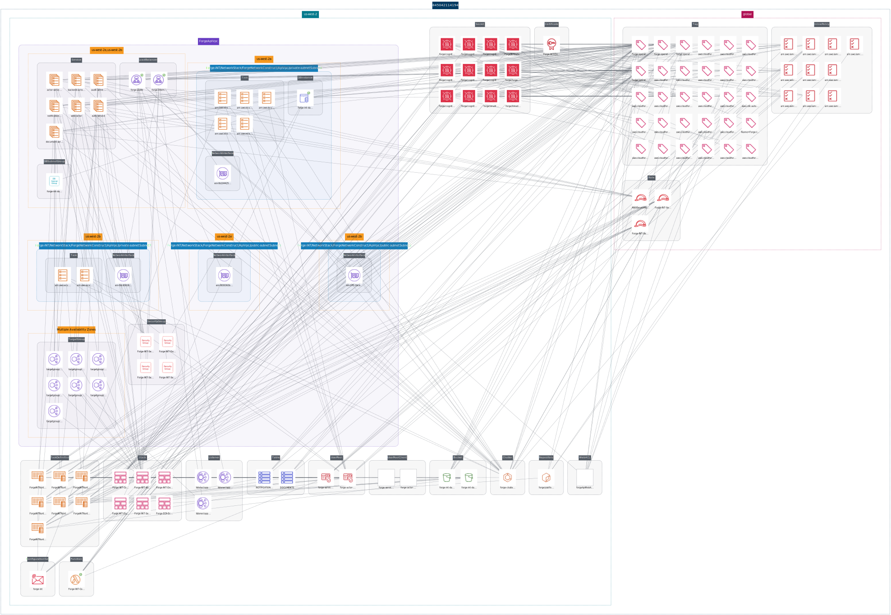

<!-- markdownlint-disable-file MD033 -->
<!-- MD033 off: inline HTML is used for spacing and image gallery layout where pure Markdown is insufficient. -->

# Documentation

The [Forge Platform](https://forgeplatform.software/) consists of the following discreet repositories:

| Repository                                            | Visibility | Description                                                                                         |
|-------------------------------------------------------|------------|-----------------------------------------------------------------------------------------------------|
| [forge-kit](https://github.com/get-forge/forge-kit)   | Public     | Infrastructure components for Quarkus services: rate limiting, metrics, health checks.              |
| `forge-core`                                          | Private    | A zero-trust, horizontally scalable microservices platform built with Quarkus, and deployed on AWS. |
| `forge-platform`                                      | Private    | A filtered mirror of `forge-core` that clients will fork, own and run with a licence.               |
| [forge-docs](https://github.com/get-forge/forge-docs) | Public     | This public documentation repository.                                                               |

`forge-kit` is open-source and a limited but useful showcase of operational best practices that anyone can re-use with
existing Quarkus services. It is also a working dependency of `forge-core`.

 

---

## How it works

- You purchase a Forge Platform licence file from the [Forge Platform website](https://forgeplatform.software/#pricing).
- Your organization is added as a Contributor, so you can fork the `forge-platform` repository.
- You then own and develop that forked codebase.
- You provision the provided CI/CD workflows in your own GitHub account (works in free tier GitHub Actions).
- You deploy the platform to your own AWS accounts (development works in free tier AWS).
- You receive any future platform updates by syncing your fork to the upstream `forge-platform` repository.

 

---

## What you get

Out of the box, the Forge Platform provides you with the following:

- A development environment built predominantly on free tier LocalStack that emulates AWS in full and spins up in
  seconds.

- An entire GitHub Actions pipeline which includes release automation; ECS deployments (diffed services only);
  infrastructure deployments (CDK); static code analysis (OWASP, SpotBugs, etc); code coverage, unit/integration
  test reports, and more.

- Full IaC support and repeatable automation for AWS environments, including thoughtful segregation of stateful vs
  stateless resources.

- A clean, well-documented, and well-tested codebase that you can fork and modify.
- A stateless reference web application that you can deploy locally and to AWS and use immediately.

  
  
  

- The following foundational services provide the base for you to build domain services on top of:
  - actor-service; canonical user profile and identity-linked domain data
  - audit-service; immutable event and action trail for compliance and observability
  - auth-service; JWT issuance, validation, and user/service authentication workflows
  - document-service; document metadata, storage orchestration, and retrieval APIs
  - notification-service; template-driven outbound messaging and delivery orchestration

- The following edge services that provide client-facing composition and delivery layers:
  - backend-actor; BFF orchestration tier
  - backend-web; disposable reference UI and consumable frontend

- Comprehensive Prometheus metrics and Grafana dashboards for observability.

  
   
   
  

For the complete list of platform features, see the [FEATURES.md](architecture/FEATURES.md) file.

 

---

## Build vs. Buy

Forge exists to remove a class of problems that most teams eventually end up solving themselves.
You can build this platform internally. Many teams do. But in practice, that path comes with trade-offs:

### Time

- Building a production-ready foundation like this typically takes multiple years.
- Progress is incremental and often delayed by competing business priorities.

### Focus

Your team splits attention between:

- domain features (what your business actually sells)
- platform engineering (infrastructure, security, reliability, operations)

This dilution slows both tracks.

### Cost

The true cost includes more than engineering time:

- iteration cycles
- operational mistakes
- rework as standards evolve

### Opportunity cost

Every month spent building foundations is a month not spent:

- shipping differentiating features
- validating your market
- generating revenue

### What Forge changes

Forge compresses that entire journey into something you can adopt immediately:

- A production-proven foundation from day one
- A clear operational model aligned with modern cloud practices
- A Quarkus-first golden path with flexibility where you need it
- A platform that lets your team stay focused on domain and business value

Instead of building the runway, you start further down it.

### When it makes sense

Forge is a strong fit, if:

- You want to move quickly without building infrastructure from scratch
- Your team is domain-focused, not platform-heavy
- You value security, consistency, operability, and scale from the outset

If your goal is to invest heavily in building a bespoke internal platform, Forge may be less relevant.

 

---

## How Forge runs in production

Forge is designed to run as a container-native platform on AWS, using a small number of well-understood building blocks.

The operating model prioritizes:

- security best-practices
- predictable operations
- clear system reasoning
- alignment with modern service deployment practices

At a high level, Forge separates edge, services, and infrastructure concerns so each layer can scale and evolve
independently.

### High-level architecture

This view shows how traffic flows through the system:

- requests enter through the edge layer
- requests are routed to stateless application services
- services rely on managed infrastructure such as datastores and messaging

Key characteristics:

- Stateless services support horizontal scaling by default
- Clear boundaries simplify ownership and evolution
- Managed AWS services reduce operational overhead

### Service and runtime model

Each service in Forge follows a consistent runtime model:

- packaged as a container
- deployed via ECS Fargate without host management
- exposes standardized health, metrics, and operational endpoints

The network model follows AWS VPC security best practices:

- public subnets host internet-facing edge components
- private subnets host application services and internal components
- security groups restrict east-west and north-south traffic to explicit service paths and ports
- public entry points terminate TLS and forward only required traffic inward

This runtime and network consistency enables:

- predictable, targeted deployments
- simpler debugging and operations
- reuse across multiple domains and teams

### What this means in practice

- You do not need to design your deployment model from scratch
- You inherit a setup aligned with enterprise production best practices
- Your team can focus on building services instead of building platform foundations

Forge gives you a starting point that is immediately usable and built to scale.

 

---

## In-depth guides

| Guide                                                                      | Description                                                                   |
|----------------------------------------------------------------------------|-------------------------------------------------------------------------------|
| [SECURITY.md](architecture/guides/SECURITY.md)                             | Platform-wide security posture, least privilege, and documented trade-offs.   |
| [USER_AUTHENTICATION.md](architecture/guides/USER_AUTHENTICATION.md)       | JWT, Cognito form login, LinkedIn OAuth, filters, and OIDC **configuration**. |
| [SERVICE_AUTHENTICATION.md](architecture/guides/SERVICE_AUTHENTICATION.md) | Service accounts, `@AllowedServices`, client filters.                         |
| [CACHING.md](architecture/guides/CACHING.md)                               | Quarkus Cache names and where they apply.                                     |
| [METRICS.md](architecture/guides/METRICS.md)                               | Micrometer, `/q/metrics`, forge-kit metrics, local Grafana.                   |
| [HEALTH_CHECK.md](architecture/guides/HEALTH_CHECK.md)                     | Readiness checks, forge-health-aws, per-service wiring.                       |
| [AUDIT_SERVICE.md](architecture/guides/AUDIT_SERVICE.md)                   | Audit library and `audit-service` HTTP ingest.                                |
| [NOTIFICATION_SERVICE.md](architecture/guides/NOTIFICATION_SERVICE.md)     | Notification delivery, templates, SNS webhook spec.                           |

 

---

## Architecture Decision Records (ADRs)

ADRs are historical *why* records (context, trade-offs, alternatives). The full public index, redaction scope, and links
to each decision can be found in **[architecture/ADRs.md](architecture/ADRs.md)**.

 

---

## Operational documentation (post-fork / deployment reference)

- [DEVELOPMENT.md](DEVELOPMENT.md) — local dev, tooling, licence, Quarkus
- [OPERATIONS.md](OPERATIONS.md) — GitHub OIDC, Actions, CDK, AWS/LocalStack
- [CHEATSHEET.md](CHEATSHEET.md) — `task` index and copy-paste
