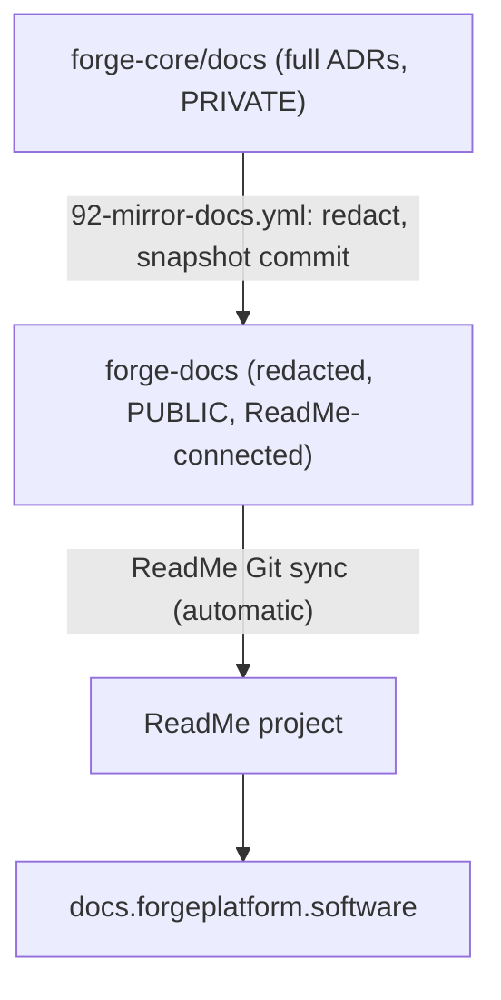

The `docs/` tree is authored in forge-core in **ReadMe bi-directional sync format** (category
folders + `_order.yaml` + `title`/`summary` frontmatter) and published to a [ReadMe](https://readme.com)
project served from `https://docs.forgeplatform.software`. forge-core stays the single source of
truth.

> ReadMe projects are **Git-backed**, so the legacy upload API (`rdme docs upload`) is not
> available. Content reaches ReadMe only through bi-directional Git sync with a connected
> repository.

## Flow



- `92-mirror-docs.yml` (runs in forge-core) copies the redacted `docs/` tree into forge-docs as
  a normal commit. No API key, no upload step. ReadMe only syncs the branch whose name matches
  its Main Version, so the mirror publishes to that branch (`MIRROR_BRANCH`, e.g. `v1.0`) — **not**
  `main` — layering onto ReadMe's initial commit so a merge base always exists.
- **forge-docs is connected to ReadMe via bi-directional Git sync**, so ReadMe ingests each
  commit automatically. Redaction happens once, in the mirror, so the connected repo is always
  public-safe.

Because ReadMe co-owns the connected repo, the mirror commits normally (no force-push / history
rewrite), and we **author only in forge-core, never in the ReadMe UI**, which keeps the sync
effectively one-way and conflict-free.

## Repository layout (bi-directional sync)

ReadMe maps **folders to categories** and uses `_order.yaml` for ordering. Each page's filename
is its URL slug. This is the layout of the ReadMe-connected mirror (forge-docs):

```text
forge-docs/
├── assets/                     # images + perf data; OUTSIDE docs/ so it is not a category
└── docs/
    ├── _order.yaml             # category order
    ├── getting-started/
    │   ├── _order.yaml         # page order within the category
    │   ├── welcome.md
    │   └── ...
    ├── architecture-guides/
    │   ├── _order.yaml
    │   ├── security.md
    │   └── ...
    ├── performance/            # own category; runs nested under performance.md
    │   ├── _order.yaml
    │   ├── performance.md
    │   └── perf-test-plan.md   # child of performance.md (via _order.yaml)
    └── architecture-decisions/
        ├── _order.yaml
        └── 0001-record-architecture-decisions.md
```

In forge-core the images live under `docs/assets/`; the mirror relocates them to the repo root
(`/assets`) so ReadMe never treats `assets` as a category. ReadMe only nests one folder level
deep — every folder under `docs/` is a **category**, so a "sub-category" is just another
top-level category folder. Parent/child page hierarchy *within* a category is expressed by
**indentation in `_order.yaml`**, not by subfolders. Page frontmatter:

```yaml
---
title: Platform security posture
summary: Security controls, accepted risks, and client responsibilities.
---
```

## One-time manual setup

These require ReadMe account, forge-docs repository, and DNS access and are not automated:

1. **Connect the repo** - the repo ReadMe syncs with must be **truly empty** (no commits or files)
   at connection time. Empty forge-docs, then in ReadMe under Settings > Git Connection install the
   ReadMe Sync GitHub App and select forge-docs. On connect, ReadMe pushes an initial commit to a
   branch **named after its Main Version** (e.g. `v1.0`); make that branch the repo default and set
   the mirror's `MIRROR_BRANCH` to match. The mirror then populates it on the next run.
2. **Custom domain** - in ReadMe under Configuration > Custom Domain set
   `docs.forgeplatform.software`, then add the provided CNAME (target
   `<subdomain-hash>.readmessl.com`) and any TXT validation record to the `forgeplatform.software`
   Route53 hosted zone. ReadMe auto-provisions SSL via Cloudflare.
3. **Retire GitHub Pages** - set the forge-docs repository's Pages source to "None".
